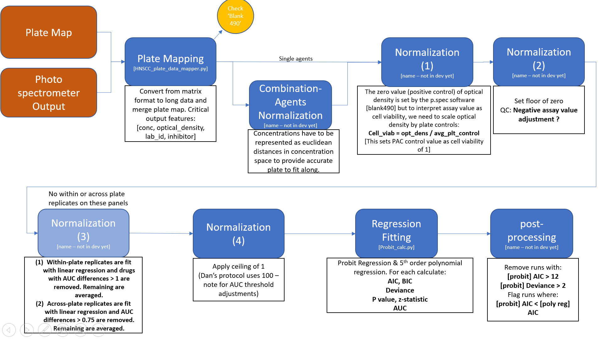

<center>  
	
| **Test**          | **Status**                                                                                                                         | Script Source                 |
|-------------------|------------------------------------------------------------------------------------------------------------------------------------|-------------------------------|
| Doc Testing       |  | ./testing/travis-ci/pytest.py |
| Unit Testing      |  | ./testing/travis-ci/pytest.py |
| Simulated Testing |  | ./testing/travis-ci/pytest.py |   
*Not currently functional, pytest.py is a dummy script for now

</center>

# HNSCC_functional_data_pipeline

This project is joint lead by Shannon McWeeney &amp; Molly F. Kulesz-Martin. The purpose of this project is to put together an analysis pipeline for functional assay data generated by the HNSCC project. 



To run this pipeline, 

```bash
$ python -W ignore run_pipeline.py 

$ python add_manual_annotations.py

$ python filter_output_data.py
```

Final `cleaned` data will be available in the `./outputs/` directory. 

See [readme](./annotation/) for more information on `adding manual annotation`. 


# Data Dictionary 

> **lab_id:** <str> unique identifier for each patient but not unique to each panel. Also, note, some patients have multiple lab_id's. 

> **norm_type:** <str> method of normalization for positive controls or "blank" wells (HNSCC uses 'F-S-V'). The photospectormeter software (Gen3) normalizes optical density by positive contols and indicate by "Blank490" designation. ['490', 'Blank490']

> **plate_num:** <int> plate number [1-6]

> **plate_row:** <str> well row [A-P]

> **assay_version_id:** <str> The plate map identifier that SHOULD be used to map the data from matrix format (photospectormeter output) to long format. Taken from filename. 

> **note:** <str> Notes used to distinguish panel assay, taken from file name. 

> **plate_col:** <int> well column number [1-24]

> **optical_density:** <float> This is the non-normalized form of our endogenous variable. Metric correlated with cell viability. 

> **conc:** <str> inhibitor concentration. Combination-agents will have concentrations listed as conc1;conc2;conc3...concX and match the order of inhibitors in `inhibitor`. 

> **inhibitor:** <str> inhibitor name. Combination-agents will be delimited by ';'

> **map_version_id:** <str> plate map version id actually used to do the mapping. 

> **iscomb:** <bool> is a combination agent assay

> **conc_norm:** <float> normalized concentration; combination agent concentrations are mapped into euclidean distance eg. conc_norm = sqrt(conc1**2 + conc2**2 ... concX**2 ). single-agent concentrations are unchanged. 

> **PAC:** <float> plate average controls; plate grouped negative control ('NONE') mean.

> **cell_viab:** <float> cell viability; normalized endogenous variable. [0,1]

> **low_PAC_flag:** <bool> this flag is set if PACs are less than 0.2 [ref?]

> **is_adj:** <bool> this flag is set if optical density was negative and a floor was applied (by rounding to 0). 

> **is_within_plate_repl:** <bool> set if there are within plate replicates for this inhibitor. 

> **is_across_plate_repl:** <bool> set if there are across plate replicates for this inhibitor

> **across_plate_repl_flag:** <bool> set if across plate replicates for this inhibitor had AUC value (calculated by linear regression in log10 space) differences that were greater than 1 [ref?] 

> **intercept:** <float> probit regression parameter; intercept in probability space.

> **beta1:** <float> probit regression parameter; slope in probability space. 

> **auc:** <float> area under the curve calculated from probit regression, however, perfect separation causes probit regression to fail and in this situation, auc is calculated by linear regression; drug sensitivity metric. 

> **prob_conv:** <bool> whether the probit regression converged. 

> **prob_AIC:** <float> probit Aikike Information Criteria value; relative metric for wellness of model fit. 

> **prob_BIC:** <float> probit Bayesian Information Criteria value; relative metric for wellness of model fit. 

> **prob_deviance:** <float> probit deviance. 

> **prob_pval:** <list> probit p-values for `intercept` and `beta0`

> **poly_degree:** <int> polynomial degree used for overfitting comparison. 

> **poly_AIC:** <float> polynomial Aikike Information Criteria value; relative metric for wellness of model fit. 

> **poly_BIC:**	<float> polynomial Bayesian Information Criteria value; relative metric for wellness of model fit. 

> **poly_deviance:** <float> polynomial deviance.

> **poly_pval:** <list> polynomial p-values for each degree

> **AIC_flag:** <bool> set if `prob_AIC` > 12
	
> **DEV_flag:** <bool> set if `prob_deviance` > 2
 	
> **overfit_flag:** <bool> set if `prob_AIC` > `poly_AIC`

> **across_plate_repl_flag_x:**	unknown ... <-------------

> **across_plate_repl_flag_y:** unknown ... <-------------
